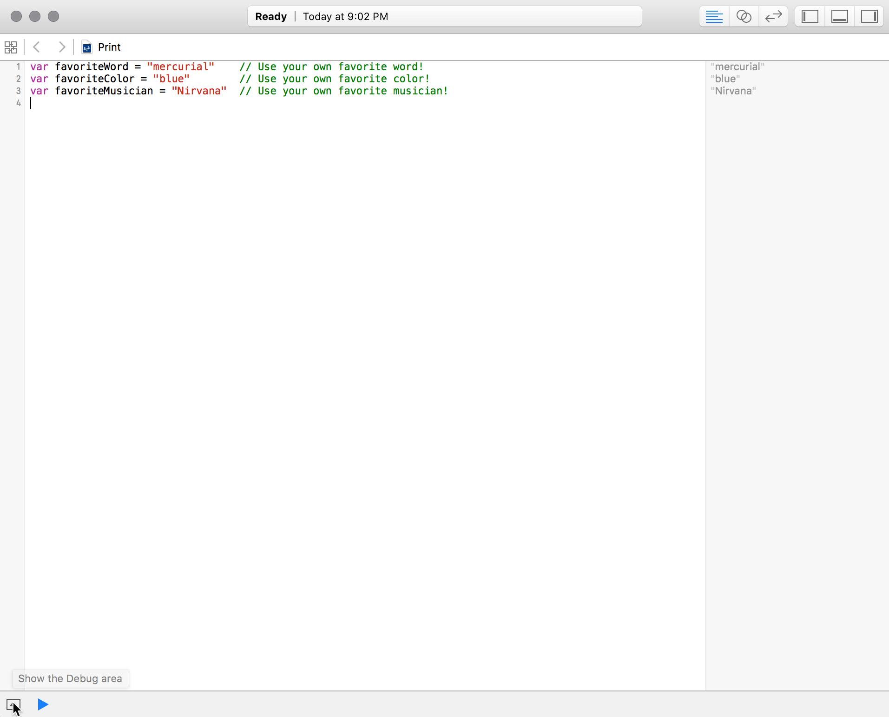
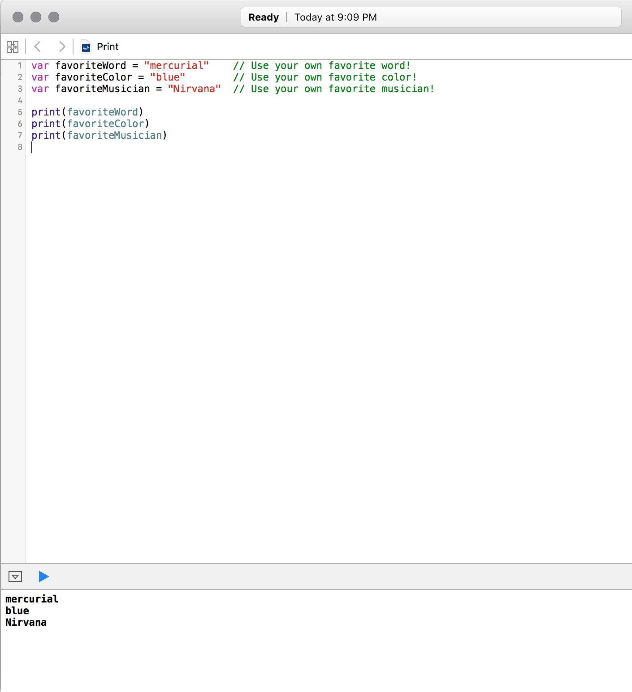

# Print Function

## Learning Objectives - The student should be able to..
* Explain the importance of being able to print your variables.
* Explain where the print function displays the text.
* Print a string literal

```swift
print("Hello Pluto")
``` 

* Print a sentence using string interpolation.

```swift
let favoriteWord = "Serendipity" 
let favoriteColor = "Green"
let favoriteMusician = "Billy Joel"

print("Hi Mom! My favorite word is \(favoriteWord), my favorite color is \(favoriteColor), and my favorite musician is \(favoriteMusician).")

// prints "Hi Mom! My favorite word is serendipity, my favorite color is green, and my favorite musician is Billy Joel"
```

* Create a sentence to store in a variable using string interpolation - as follows:

```swift
let favoriteWord = "Serendipity"

let favoriteSentence = "Hello everyone, how are you doing? My favorite word is \(favoriteWord)"

print(favoriteSentence)
// prints "Hello everyone, how are you doing? My favorite word is Serendipity"
```

## What the student can do at this point 
* Create variables and constants only using String types 

```swift
let name = "Ned Stark"  // the student has seen this
```

## Printing Values

When learning Swift, one of the most basic things you'll no doubt want to do is print stuff to the screen. Even once you know Swift inside and out, displaying strings, numbers, and other data on the screen is one of the most fundamental things you'll need to do on a regular basis, because what good is a program that never presents any information to its users?

In Swift, you can print a variable or a constant to the screen using the `print()` function. Let's see that in action by creating a playground file, as you learned in the last lesson.

After creating your new playground in Xcode, start by declaring three strings representing your favorite word, color, and musician. First ask yourself: Should these be _variables_ (declaring using `var`) or _constants_ (declared using `let`)? You probably feel pretty strongly about your favorite word, color, and musician, but your tastes may change over time, so let's declare them as variables for now. You should enter them in your playground file:

```swift
var favoriteWord = "mercurial"    // Use your own favorite word!
var favoriteColor = "blue"        // Use your own favorite color!
var favoriteMusician = "Nirvana"  // Use your own favorite musician!
```

You'll see your values represented in the sidebar on the right side of your playground:


Why do you see output if you haven't even called the `print()` function yet? It's important to note that the right sidebar in a playground file doesn't represent program _output_; rather, it's a look at how your program is working and what values different variables and constants have. If this were a real program being run outside of a playground file, you wouldn't see any output at all. Playgrounds are special in that they show you the state of your program at given moments, even if you're not explicitly outputting any data.

However, a playground also allows you to see what would be printed to your screen if your program was run outside of a playground file. You can see that output by clicking the little upward-facing arrow at the bottom of the playground file:



Clicking that arrow will reveal the "Debug area", which is what Xcode calls the part of the playground file that shows your program's output.

Now you can show the results of printing out the variables you just created.

Printing variables is easy: Just pass them to the `print()` function. You can do that by typing `print(variable)`. Add these lines to the end of your playground to print the values of your variables:

```swift
print(favoriteWord)
print(favoriteColor)
print(favoriteMusician)
```

Now you will see your program's output in the bottom pane of the playground:



## Printing Strings

Swift's `print()` function can be used to print anything, not just variables and constants. You can also print entire strings. Just like variables and constants, you print a string by passing it to the `print()` function. Put this in your playground file and see what happens:

```swift
print("I'm printing a string in Swift!")
```

You should see the string "I'm printing a string in Swift!" in the playground's output pane, along with the other variables you printed before.

You can even print longer sentences using the `print()` function. There's no limit to what you can print! Try printing the sentence "Hi Mom! My favorite word is serendipity, my favorite color is green, and my favorite musician is Billy Joel." and see what happens:

```swift
print("Hi Mom! My favorite word is serendipity, my favorite color is green, and my favorite musician is Billy Joel.")
```

## Combining Strings and Variables

At this point you may be thinking, "Wait a minute! Serependity doesn't exactly roll off the tongue, I hate green, and Billy Joel makes my ears bleed!" You've probably also remembered that you already declared variables to hold your favorite word, color, and musician, so why are you having to pledge your undying love for these things you don't like? Why can't you print out your own preferences?

Guess what? You can! Swift has a very helpful feature to combine strings and variables: _interpolation_. When you interpolate a string, you can mix in a variable (or constant) you declared before along with a string. Swift will calculate a new string based on the one you provided along with the variables or constants you wish to be interpolated.

String interpolation is easy in Swift. Inside a string, you can substitute in the value of a variable by placing that variable name within a `\` and surrounding it by parentheses. Here is a pretty simple example of string interpolation:

```swift
let color = "blue"
print("The sky is \(color).")
```

Try putting that in your playground file and see what happens.

Did you spot where the variable was interpolated? `\(color)` lets Swift know that you want to print the _value_ of the constant `color`, so it creates a string that substitutes that value in place of `\(color)`. In the output pane, you should see the string "The sky is blue." You _won't_ see "The sky is \(color)" though!

Now that you know about string interpolation, can you figure out how to say hi to your mom and let her know what your favorite word, color, and musician are?

Try entering this into your playground file:

```swift
print("Hi Mom! My favorite word is \(favoriteWord), my favorite color is \(favoriteColor), and my favorite musician is \(favoriteMusician).")

// prints "Hi Mom! My favorite word is mercurial, my favorite color is blue, and my favorite musician is Nirvana."
```

Try creating other variables in your playground file and printing them out using the `print()` function and string interpolation.

String interpolation doesn't happen only in the `print()` function. You can use string interpolation anywhere you create a string—even when declaring one. Try creating a variable using string interpolation, then display it on the screen using the `print()` function. Here's an example:

```swift
var skySentence = "The sky is \(color)."
print(skySentence)

// "The sky is blue."
```

String interpolation is a very useful part of Swift, and you will continue to use this fundamental feature in the rest of your Swift code.

<a href='https://learn.co/lessons/Print' data-visibility='hidden'>View this lesson on Learn.co</a>
